# Evidências Funcionais

Este documento orienta quais evidências (prints de tela, e/ou vídeo)
devem ser capturadas para comprovar o funcionamento de cada requisito
do checklist, conforme exigido pelo item **"Testes via Front-end"**
das diretrizes de entrega.

## Checklist de evidências

### Etapa 1 — Autenticação e Gestão de Credenciais

- [x] **Cadastro de usuário** — tela de registro preenchida.

      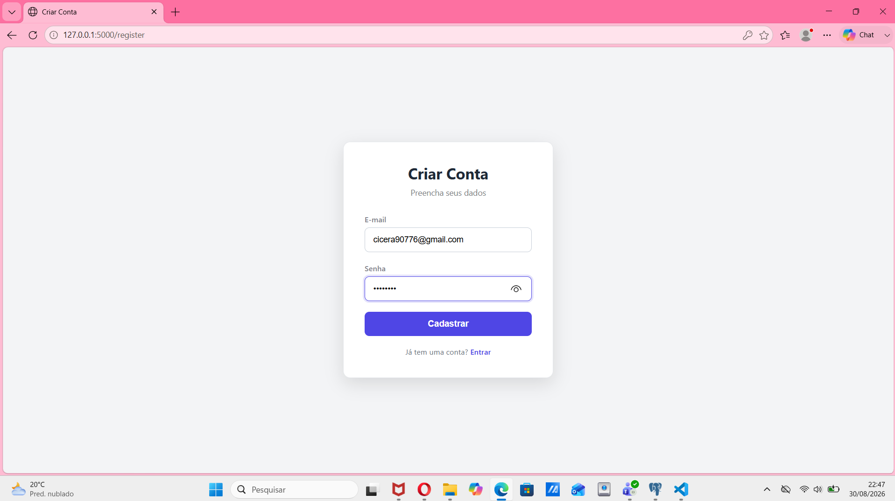

- [x] **Banco de dados** — print da tabela `usuarios` mostrando que a senha está salva como
      hash + salt, nunca em texto puro. *(Requisitos 1.1 a 1.4)*

      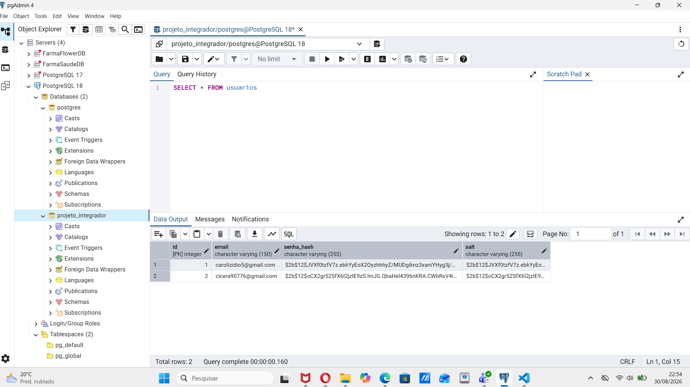

- [x] **Login com credenciais corretas** — tela de login preenchida e
      redirecionamento para a verificação de 2FA.

      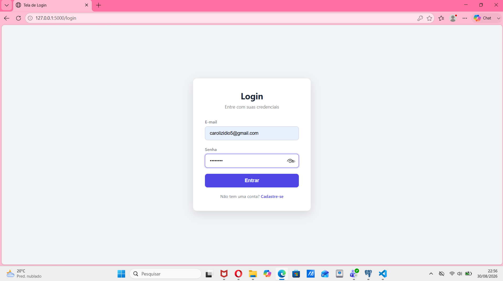

- [x] **E-mail com o código de 2FA recebido** — print da caixa de
      entrada mostrando o e-mail chegando com o código de 6 dígitos.
      *(Requisito 1.5)*

      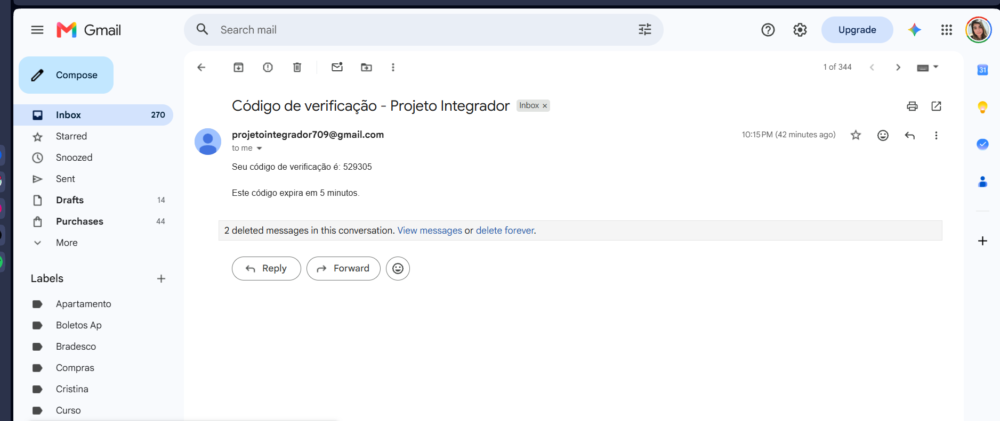

- [x] **Verificação do código de 2FA com sucesso** — tela digitando o
      código e sendo redirecionado ao dashboard. *(Requisito 1.6)*

      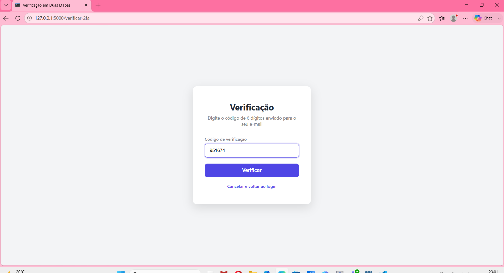

- [x] **Tentativa com código de 2FA incorreto** — mensagem de erro
      "Código incorreto". *(Requisito 1.6)*

      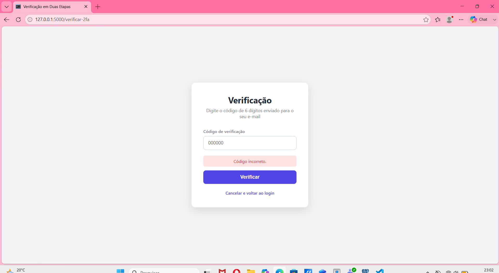

- [x] **Login com credenciais inválidas** — mensagem de erro
      "Credenciais inválidas".

      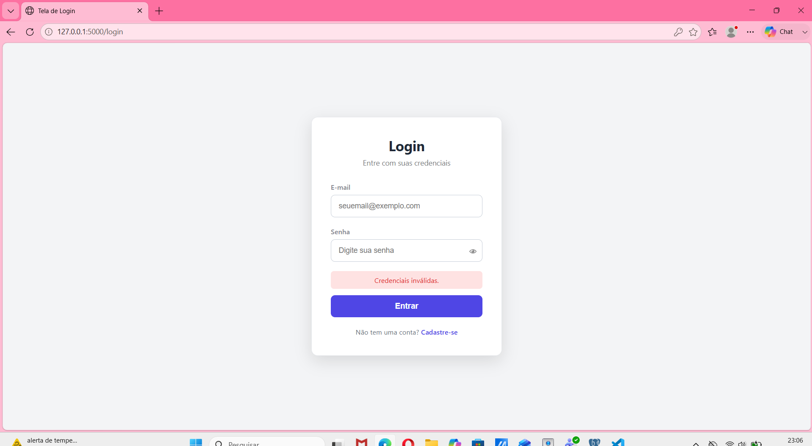

- [x] **Sessão ativa** — acesso ao `/dashboard` mostrando o e-mail do
      usuário logado.

      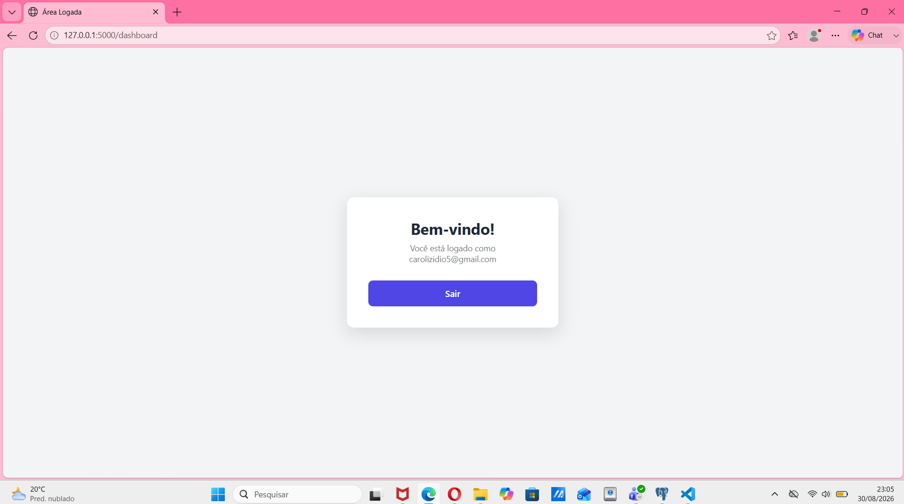

- [x] **Bloqueio por força bruta** — errar a senha 5 vezes seguidas e
      receber a mensagem de bloqueio temporário na 6ª tentativa.
      *(Requisito 1.11)*

      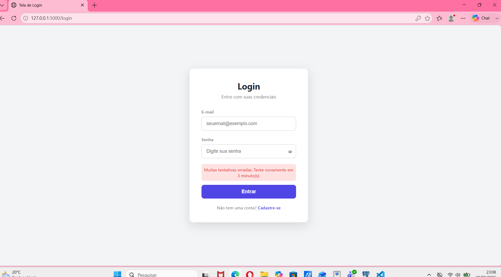

### Etapa 2 — Recuperação de Senha

- [x] **Solicitação de recuperação** — tela `/esqueci-senha` preenchida
      e mensagem genérica de confirmação exibida. *(Requisito 2.1)*

      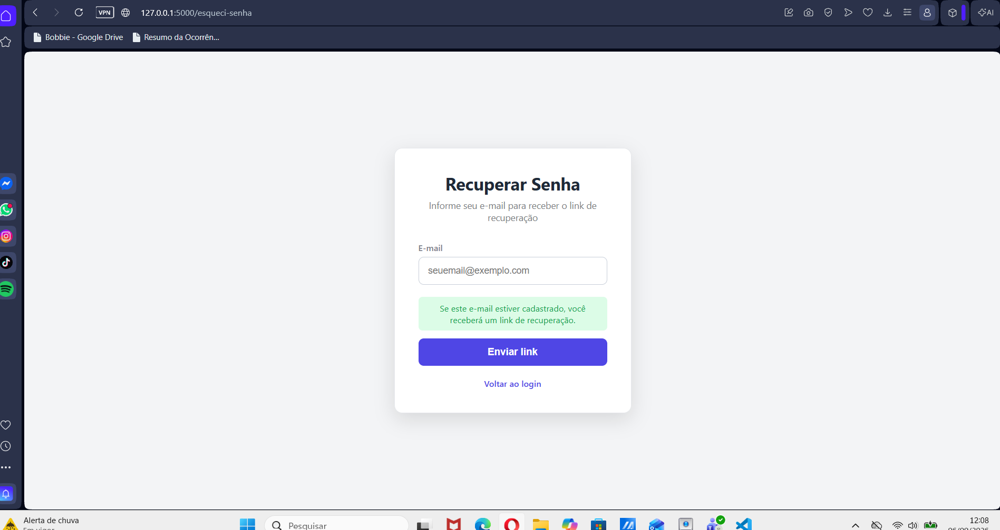      

- [x] **E-mail de recuperação recebido** — print da caixa de entrada
      mostrando o link de redefinição. *(Requisitos 2.1, 2.2)*

      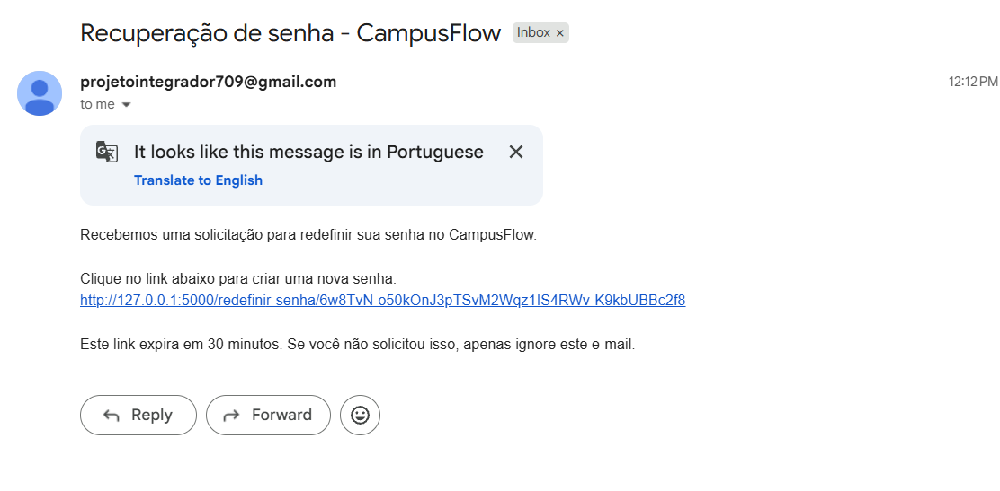 

- [x] **Redefinição de senha com sucesso** — tela de nova senha
      preenchida e redirecionamento ao login com mensagem de sucesso.
      *(Requisitos 2.1, 2.3, 2.4)*

      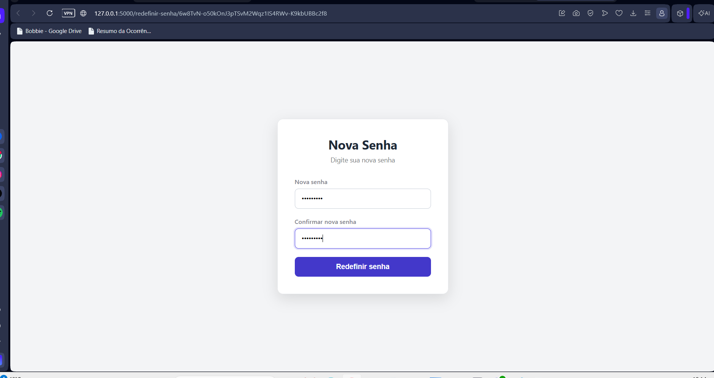 
      !(evidencias/13 - Mensagem de sucesso na troca de senha.png) 

- [x] **Tentativa de reutilizar o mesmo link** — acessar o mesmo link
      de recuperação uma segunda vez após já ter sido usado, e receber
      a mensagem "Este link já foi utilizado". *(Requisito 2.4)*

      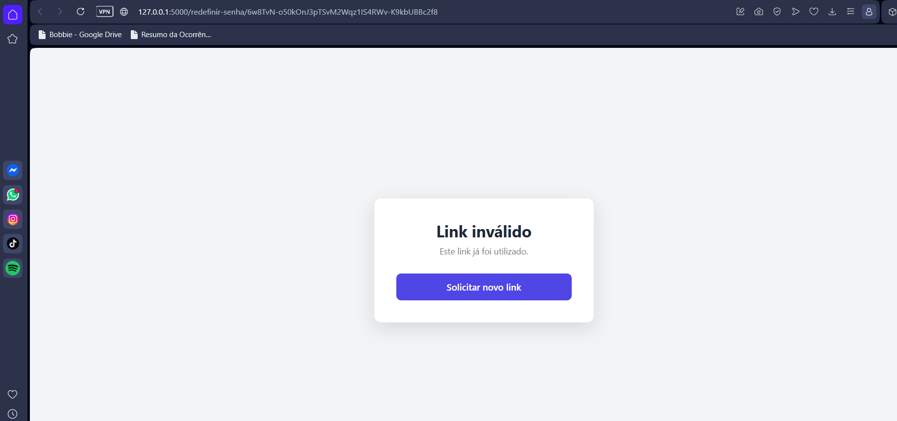

- [x] **Token expirado** — acessar um link de recuperação depois de
      mais de 30 minutos e receber a mensagem "Este link de
      recuperação expirou". *(Requisito 2.5)*

      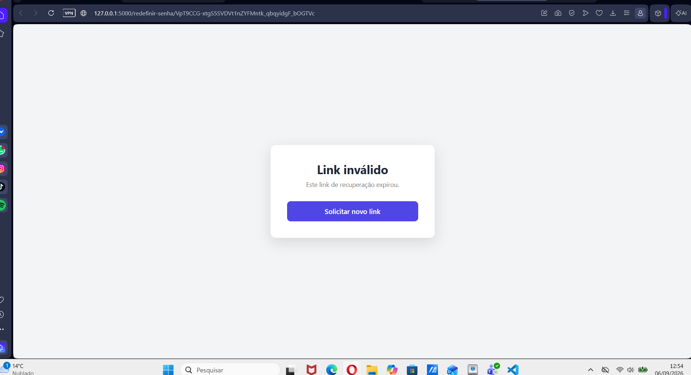

- [x] **Log de eventos** — print do conteúdo do arquivo
      `logs/eventos.log` mostrando as linhas de `SOLICITACAO_RECUPERACAO`,
      `REDEFINICAO_SENHA_SUCESSO`

      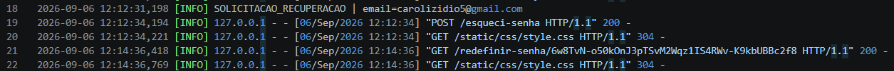
      (evidencias/16 - Redefinição senha sucesso.png)

- [x] **Video requesito 2** — Video mostrando o processo de recuperação de senha.

      (evidencias/Requesito 2.mp4)
