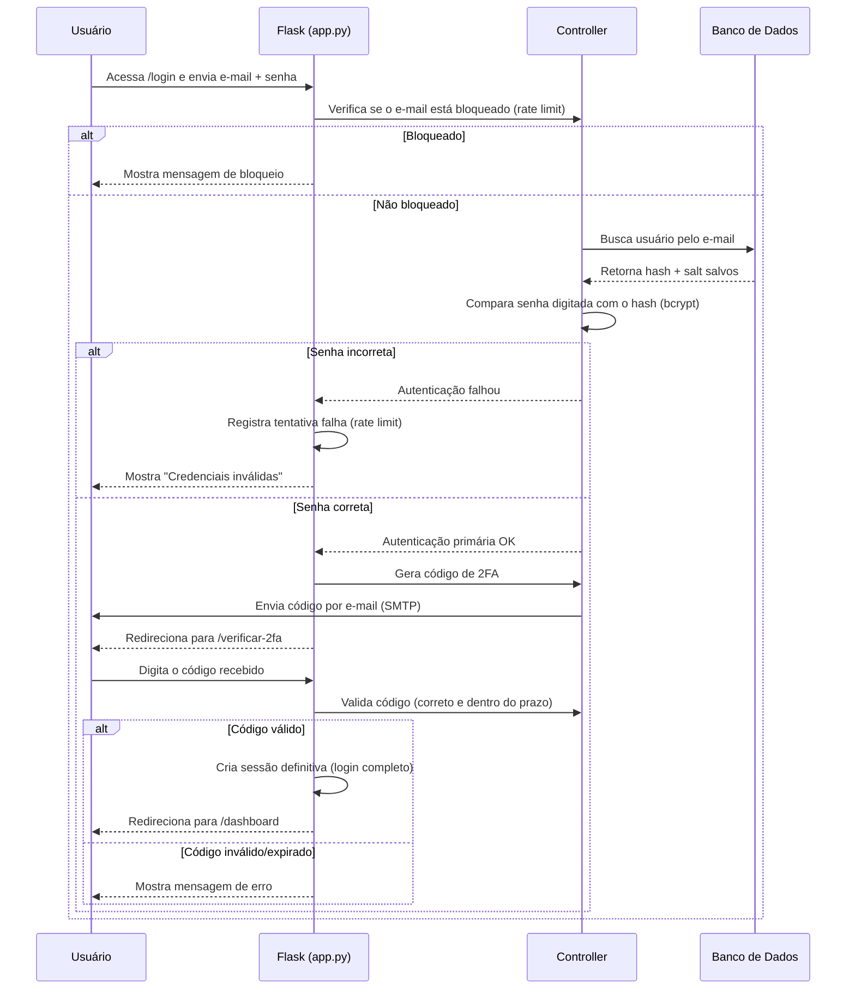

# Fluxo de Autenticação e Gestão de Credenciais

Este documento descreve como funciona o sistema de login do projeto,
cobrindo o checklist de requisitos **1. Autenticação e Gestão de
Credenciais**.

## Arquitetura

O projeto segue o padrão **MVC (Model-View-Controller)**, implementado
com **Flask** (Python):

| Camada | Onde fica | Responsabilidade |
|---|---|---|
| Model | `models/user_model.py` | Salvar e buscar usuários no PostgreSQL |
| View | `templates/*.html` | Telas renderizadas pelo Flask (Jinja2) |
| Controller | `app.py` + `controllers/` | Recebe requisições, aplica as regras de negócio e decide qual View mostrar |

O Flask **renderiza o HTML no servidor** (Server-Side Rendering): o
usuário nunca recebe dados "crus" — a página já chega pronta, com as
mensagens de erro/sucesso preenchidas pelo `render_template()`.

## Passo a passo do fluxo de login

## Detalhamento por requisito

### 1.1 a 1.4 — Hash, salt e armazenamento de senha

Arquivo: `controllers/auth_controller.py`

- A senha **nunca** é salva em texto puro.
- No cadastro (`registrar_usuario`), é gerado um **salt único** por
  usuário com `bcrypt.gensalt()`, e a senha é transformada em um
  **hash** com `bcrypt.hashpw()`.
- O hash e o salt são salvos no banco (`models/user_model.py`,
  tabela `usuarios`).
- No login (`autenticar_usuario`), a senha digitada é comparada com o
  hash salvo usando `bcrypt.checkpw()` — o bcrypt já sabe extrair o
  salt de dentro do próprio hash, então não é necessário buscá-lo
  separadamente para essa comparação.

### 1.5 e 1.6 — Autenticação de dois fatores (2FA)

Arquivos: `controllers/auth_controller.py`, `app.py`,
`templates/two_factor.html`

- Depois que o e-mail e a senha são validados, o login **não é
  concluído imediatamente**.
- Um código numérico de 6 dígitos é gerado (`gerar_codigo_2fa`) e
  enviado por e-mail via SMTP (Gmail), usando a biblioteca `smtplib`.
- O usuário é redirecionado para `/verificar-2fa`, onde precisa
  digitar o código recebido.
- O código é validado (`verificar_codigo_2fa`) checando se é igual ao
  gerado **e** se ainda está dentro do prazo de validade (5 minutos).
- Somente após essa verificação a sessão definitiva do usuário é
  criada.

### 1.9 e 1.10 — Sessão e logout

Arquivo: `app.py`

- Após o login completo (senha + 2FA), os dados do usuário são
  guardados na `session` do Flask.
- A sessão é configurada como **permanente**, com expiração
  automática após 15 minutos de inatividade
  (`app.permanent_session_lifetime`).
- No logout (`/logout`), a sessão é completamente limpa
  (`session.clear()`), invalidando o acesso imediatamente.

### 1.11 — Proteção contra força bruta (rate limit)

Arquivo: `controllers/rate_limit_controller.py`

- Cada e-mail tem um contador de tentativas de login malsucedidas.
- Após **5 tentativas erradas seguidas**, o e-mail fica **bloqueado
  por 3 minutos** — novas tentativas são recusadas antes mesmo de
  checar a senha.
- O contador é zerado assim que o login é bem-sucedido.

## Segurança de configuração

As credenciais sensíveis (senha do banco de dados, senha de app do
e-mail e chave secreta do Flask) **não ficam escritas no código-fonte**.
Elas são carregadas de um arquivo `.env`, que fica apenas na máquina
de quem roda o projeto e nunca é enviado ao GitHub (está listado no
`.gitignore`). O arquivo `.env.example` serve como modelo para quem
for configurar o projeto pela primeira vez.
