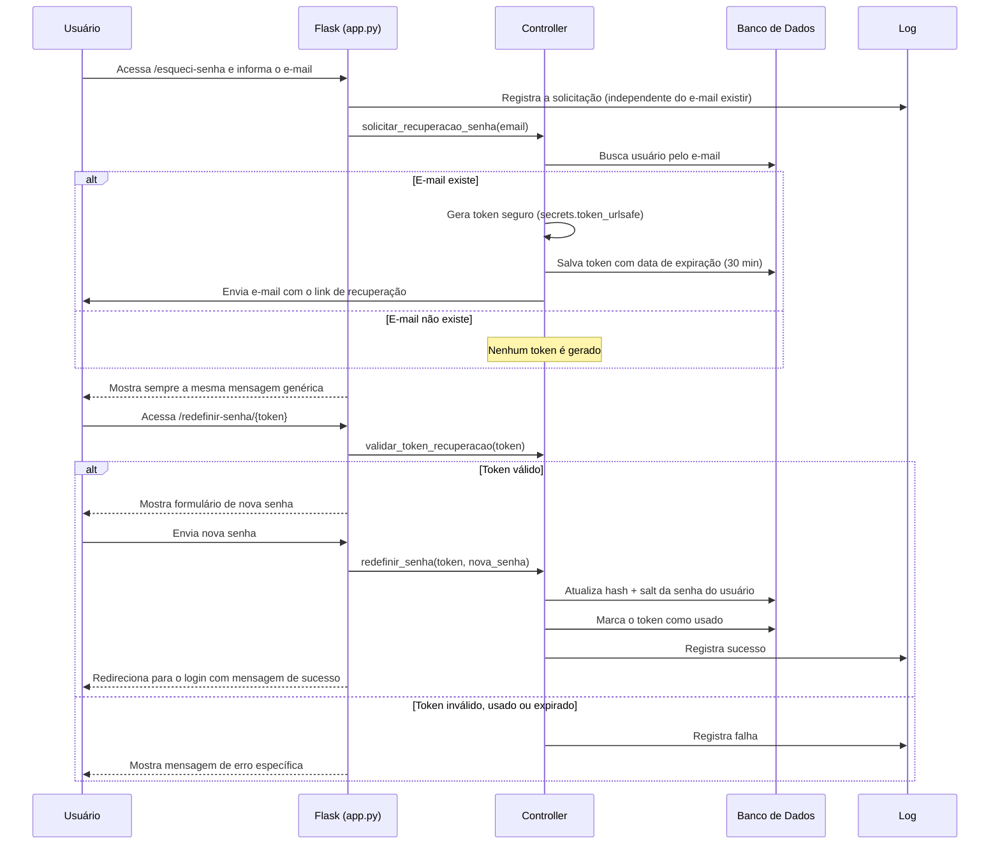

# Fluxo de Recuperação de Senha

Este documento descreve como funciona a recuperação de senha do
sistema, cobrindo o checklist de requisitos **2. Recuperação de
Senha**.

## Arquitetura

Assim como o módulo de autenticação, este fluxo segue o padrão MVC:

| Camada | Onde fica | Responsabilidade |
|---|---|---|
| Model | `models/token_model.py` | Salvar, buscar e invalidar tokens de recuperação |
| Model | `models/user_model.py` | Atualizar a senha do usuário (`atualizar_senha_usuario`) |
| View | `templates/forgot_password.html`, `templates/reset_password.html` | Telas do fluxo |
| Controller | `controllers/recovery_controller.py` | Geração e validação do token, troca de senha |
| Log | `config/logger.py` | Registro de eventos em `logs/eventos.log` |

## Passo a passo do fluxo

## Detalhamento por requisito

### 2.1 — Funcionalidade de recuperação de senha implementada

Rotas em `app.py`: `/esqueci-senha` (solicita o link) e
`/redefinir-senha/<token>` (define a nova senha). A lógica de negócio
fica isolada em `controllers/recovery_controller.py`.

### 2.2 — Token criptograficamente seguro

O token é gerado com `secrets.token_urlsafe(32)`. O módulo `secrets`
do Python usa uma fonte de aleatoriedade adequada para fins
criptográficos (diferente do módulo `random`, que é previsível e não
deve ser usado para gerar tokens de segurança).

### 2.3 — Token com tempo de expiração

Ao salvar o token (`salvar_token`), é gravado também um campo
`expira_em`, calculado como 30 minutos a partir do momento da
solicitação (`TEMPO_EXPIRACAO_TOKEN_MINUTOS`).

### 2.4 — Token invalidado após uso

A tabela `tokens_recuperacao` tem uma coluna `usado` (booleana). Assim
que a senha é redefinida com sucesso, `marcar_token_como_usado()` é
chamada, impedindo que o mesmo link seja reutilizado.

### 2.5 — Falha correta para token expirado

A função `validar_token_recuperacao()` verifica três condições antes
de aceitar um token: se ele existe, se já foi usado e se a data atual
já passou de `expira_em`. Cada caso retorna uma mensagem de erro
específica ao usuário.

### 2.6 e 2.7 — Registro em log

Todo pedido de recuperação é registrado em `logs/eventos.log` através
de `registrar_evento()`, incluindo:
- O momento da solicitação (mesmo que o e-mail não exista no sistema)
- O resultado da tentativa de redefinição (sucesso ou motivo da falha)

Isso é feito independentemente do e-mail existir ou não, para não
revelar informações sobre quais contas estão cadastradas apenas pelo
comportamento do sistema.

## Decisão de segurança: mensagem genérica

Por segurança, a rota `/esqueci-senha` sempre retorna a mesma mensagem
("Se este e-mail estiver cadastrado, você receberá um link..."),
independentemente de o e-mail existir ou não no banco. Isso evita que
um atacante use o formulário de recuperação para descobrir quais
e-mails estão cadastrados no sistema (um problema conhecido como
"user enumeration").